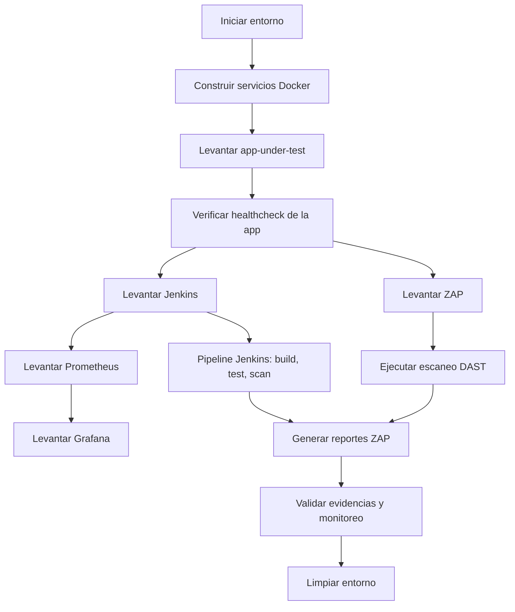

# Entrega: Prueba Ciberseguridad

## 1. Portada

- **Asignatura:** Ciberseguridad
- **Actividad:** Prueba 3 - Flujo DevSecOps local
- **Alumno:** Mauricio Tapia
- **RUT:** 20096446-2
- **Docente:** Marco Antonio Perelli
- **Fecha de entrega:** 17-junio-2026

---

## 2. Objetivo

Desarrollar un flujo DevSecOps local que utilice Jenkins y Docker para construir, validar, desplegar y supervisar una aplicación web de laboratorio, incorporando controles de seguridad automatizados y documentación de hallazgos durante el ciclo de vida de desarrollo, donde se contemple:

- Orquestación de servicios con Docker Compose.
- Implementación de Jenkins como pipeline de CI/CD.
- Configuración de monitoreo con Prometheus y Grafana.
- Ejecución de un análisis DAST con OWASP ZAP.
- Verificación y registro de evidencias para la pauta.

---

## 3. Alcance y contexto

El alcance del proyecto es implementar y validar un entorno DevSecOps local para la aplicación Prueba-Ciberseguridad, documentando todo el proceso desde la orquestación de servicios hasta la generación de evidencias. Incluye:

Servicios incluidos:

- `app-under-test` (aplicación bajo prueba)
- `jenkins` (pipeline de integración)
- `prometheus` (recolección de métricas)
- `grafana` (visualización de métricas)
- `zap` (análisis DAST)

Herramientas utilizadas:

- Docker / Docker Compose
- Jenkins
- Prometheus
- Grafana
- OWASP ZAP
- Python

---

## 4. Diagrama general del proceso

1. Preparar entorno local con Docker Compose.
2. Construir y desplegar servicios.
3. Ejecutar healthchecks para validar estado de contenedores.
4. Ejecutar pipeline de pruebas y DAST.
5. Revisar evidencias y reportes generados.

### 4.1 Diagrama de flujo



---

## 5. Desarrollo del trabajo

### 5.1. Preparación del entorno

Pasos ejecutados:

1. Clonar el repositorio y ubicar la carpeta del proyecto.
2. Revisar archivos principales:
   - `docker-compose.yml`
   - `Dockerfile`
   - `Dockerfile.jenkins`
   - `Jenkinsfile`
   - `README.md`
   - `prometheus.yml`
3. Asegurar que `docker` y `docker compose` estén instalados.
4. Crear carpetas de evidencia y reportes.

### 5.2. Configuración de Docker Compose

Se utilizó un archivo `docker-compose.yml` con los servicios mencionados. Las configuraciones clave fueron:

- `ports` para exponer Jenkins, Grafana, Prometheus, ZAP y la app.
- `healthcheck` para validar que cada servicio esté listo.
- `depends_on` para ordenar el arranque de los servicios dependiendo del estado saludable.
- Red `devsecops_net` compartida para comunicación entre contenedores.

Evidencia del archivo de configuración:

- `docker-compose.yml`
- `Dockerfile`
- `Dockerfile.jenkins`

### 5.3. Implementación de la aplicación bajo prueba

La aplicación usa un servidor Python simple en el puerto `8080`.

- `Dockerfile` expone el puerto `8080`.
- `CMD` ejecuta `python3 -m http.server 8080`.
- Healthcheck de `app-under-test` verifica `http://127.0.0.1:8080/`.

### 5.4. Configuración de monitoreo

- `prometheus.yml` agrega el target `app-under-test:8080`.
- Grafana se configura con persistencia en el volumen `grafana_data`.

### 5.5. Pipeline de Jenkins

El `Jenkinsfile` debe incluir etapas para:

- Checkout del repositorio.
- Construcción de la imagen Docker de la aplicación.
- Ejecución de pruebas.
- Escaneo DAST con ZAP.
- Archivo de reportes.

Evidencia de configuración de Jenkins:

- `Jenkinsfile`
- `Dockerfile.jenkins`

### 5.6. Ejecución de análisis DAST

El escaneo ZAP se realiza con el script `run-dast.sh` y genera reportes en:

- `reports/zap/zap-full-report.html`
- `reports/zap/zap-full-report.json`
- `reports/zap/zap-full-report.xml`

---

## 6. Resultados y evidencias

### 6.1. Comandos ejecutados

1. Levantar stack completo:

```bash
./run-all.sh
```

2. Verificar estado de los contenedores:

```bash
docker compose ps
```

3. Revisar logs del contenedor de la aplicación:

```bash
docker compose logs --tail 50 app-under-test
```

4. Ejecutar escaneo DAST:

```bash
./run-dast.sh
```

5. Validar monitoreo:

```bash
./validate-monitoring.sh
```

6. Limpiar el entorno:

```bash
./clean.sh
```

### 6.2. Evidencias de resultados

- **Evidencia 1:** Captura de `docker compose ps` con todos los servicios en estado healthy.
  
- **Evidencia 2:** Captura de `docker compose logs app-under-test` mostrando arranque correcto.
  
- **Evidencia 3:** Captura de ZAP generando reportes.
  
- **Evidencia 4:** Captura de Grafana y Prometheus disponibles en el navegador.
  
  
- **Evidencia 6:** Captura de los reportes generados en `reports/zap/`.
  

### 6.3. Archivos de evidencia generados

- `reports/zap/zap-full-report.html`
- `reports/zap/zap-full-report.json`
- `reports/zap/zap-full-report.xml`
- `reports/test-results.xml` (si aplica)

---

## 7. Problemas detectados y soluciones

### 7.1. Problema principal

- La aplicación `app-under-test` no alcanzaba el estado `healthy` con `curl` dentro del healthcheck.
- Esto ocurría porque la imagen base `python:3.12-slim` no siempre incluye `curl` y el servicio fallaba al iniciar.

### 7.2. Solución aplicada

- Se actualizó el healthcheck de `app-under-test` para usar `python3` y verificar `http://127.0.0.1:8080/`.
- Se corrigió la configuración YAML duplicada en `docker-compose.yml`.

### 7.3. Otros ajustes

- Se limpió el bloque duplicado de `volumes/networks` en `docker-compose.yml`.
- Se mejoró la documentación de los scripts de ejecución.

---

## 8. Conclusiones

- El flujo DevSecOps se completó con un stack local funcional de Jenkins, ZAP, Prometheus y Grafana.
- La solución validó la importancia de los healthchecks en servicios Docker.
- Quedó documentado el proceso y las evidencias necesarias para la pauta.

---

## 9. Anexos

- Capturas de pantalla y evidencias en formato PNG o JPG.
- Reportes ZAP generados en `reports/zap/`.
- Archivos de configuración modificados: `docker-compose.yml`, `Dockerfile`, `Dockerfile.jenkins`, `Jenkinsfile`, `prometheus.yml`.

> Nota: Completar los campos en blanco y reemplazar las rutas de las imágenes con los archivos de evidencia generados.
