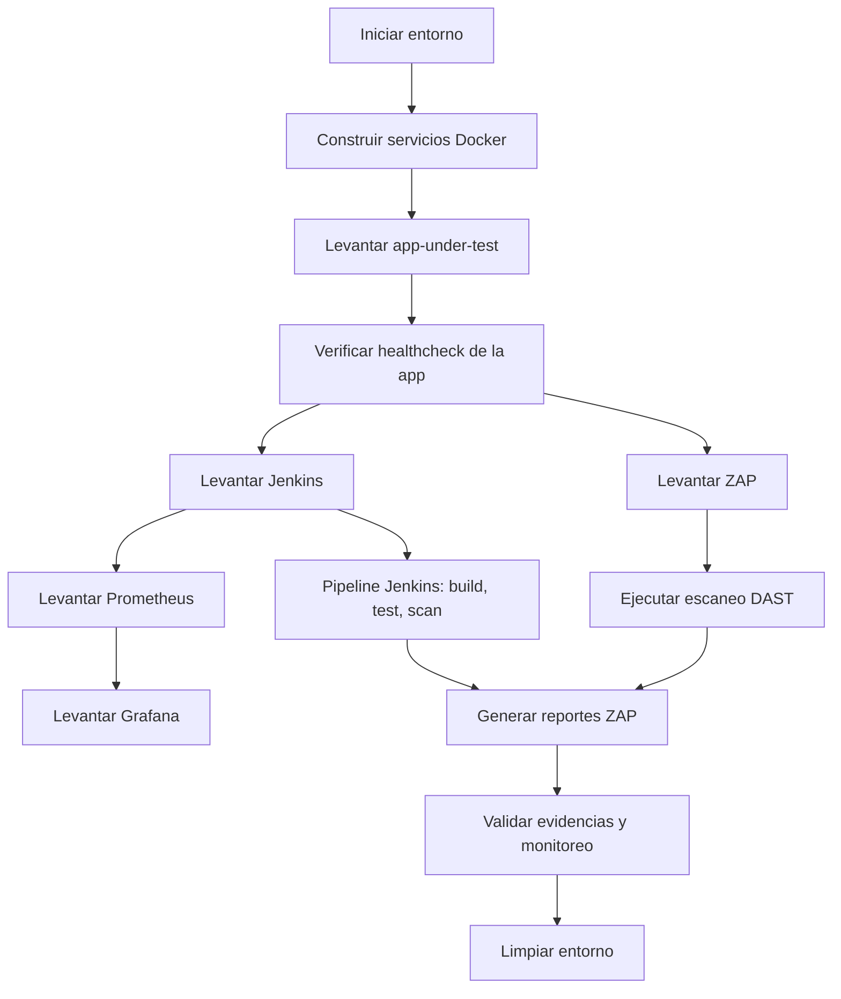
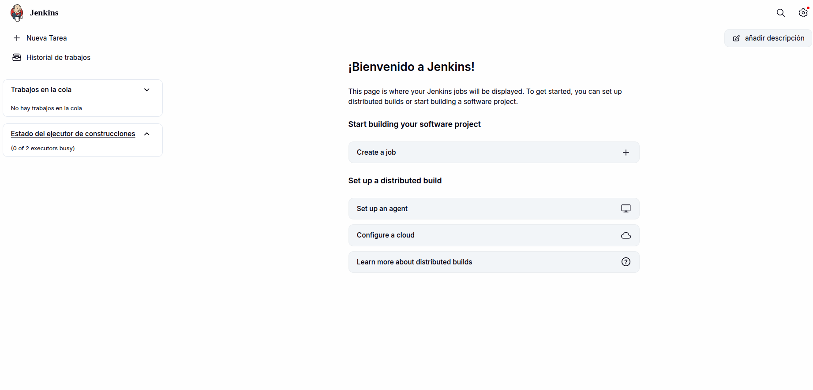
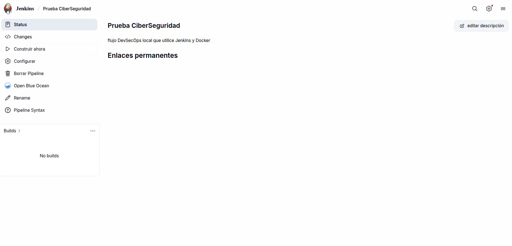
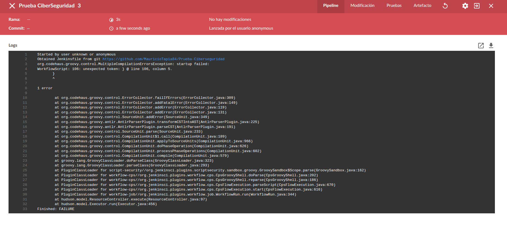
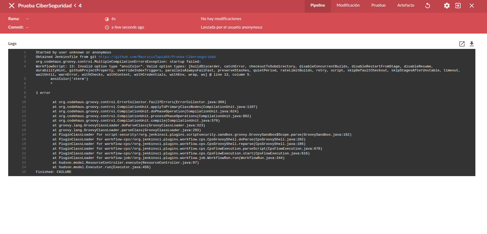
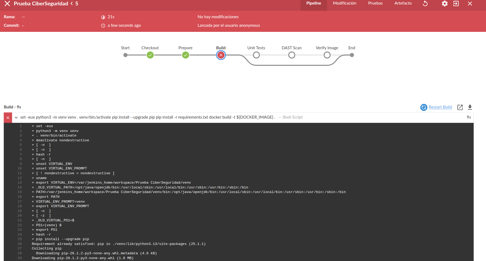
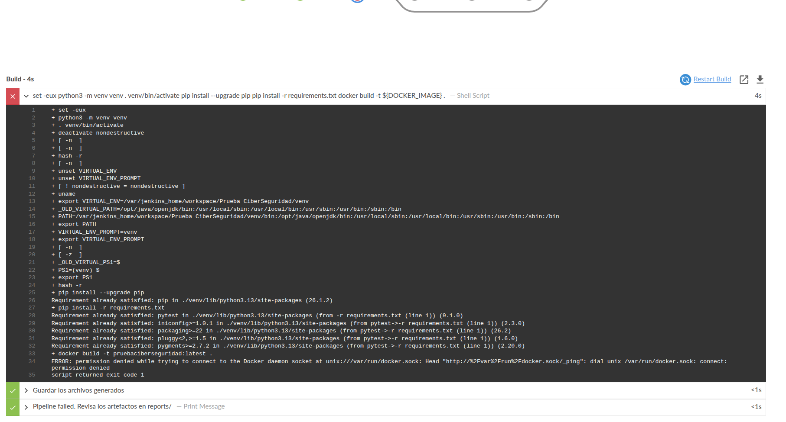
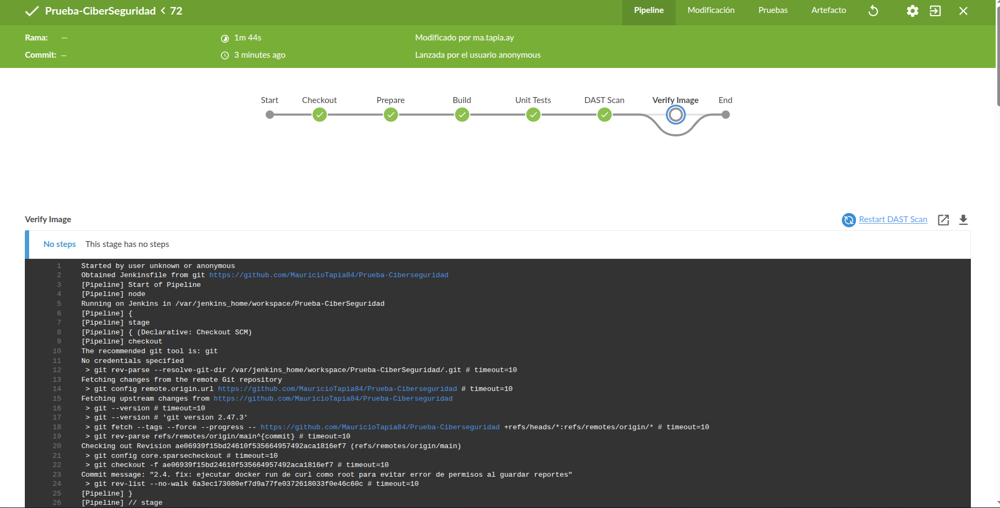
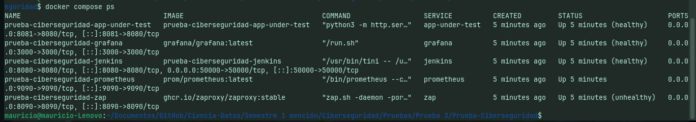

# Entrega: Prueba Ciberseguridad

## 1. Portada

- **Asignatura:** Ciberseguridad
- **Actividad:** Prueba 3 - Flujo DevSecOps local
- **Alumno:** Mauricio Tapia
- **RUT:** 20096446-2
- **Docente:** Marco Antonio Perelli
- **Fecha de entrega:** 17-junio-2026

---

## 2. Objetivo

Desarrollar un flujo DevSecOps local que utilice Jenkins y Docker para construir, validar, desplegar y supervisar una aplicación web de laboratorio, incorporando controles de seguridad automatizados y documentación de hallazgos durante el ciclo de vida de desarrollo, donde se contemple:

- Orquestación de servicios con Docker Compose.
- Implementación de Jenkins como pipeline de CI/CD.
- Configuración de monitoreo con Prometheus y Grafana.
- Ejecución de un análisis DAST con OWASP ZAP.
- Verificación y registro de evidencias para la pauta.

---

## 3. Alcance y contexto

El alcance del proyecto es implementar y validar un entorno DevSecOps local para la aplicación Prueba-Ciberseguridad, documentando todo el proceso desde la orquestación de servicios hasta la generación de evidencias. Incluye:

Servicios incluidos:

- `app-under-test` (aplicación bajo prueba)
- `jenkins` (pipeline de integración)
- `prometheus` (recolección de métricas)
- `grafana` (visualización de métricas)
- `zap` (análisis DAST)

Herramientas utilizadas:

- Docker / Docker Compose
- Jenkins
- Prometheus
- Grafana
- OWASP ZAP
- Python

---

## 4. Diagrama general del proceso

1. Preparar entorno local con Docker Compose.
2. Construir y desplegar servicios.
3. Ejecutar healthchecks para validar estado de contenedores.
4. Ejecutar pipeline de pruebas y DAST.
5. Revisar evidencias y reportes generados.

### 4.1 Diagrama de flujo



---

## 5. Desarrollo del trabajo

### 5.1. Preparación del entorno

Pasos ejecutados:

1. Clonar el repositorio y ubicar la carpeta del proyecto.
2. Revisar archivos principales:
   - `docker-compose.yml`
   - `Dockerfile`
   - `Dockerfile.jenkins`
   - `Jenkinsfile`
   - `README.md`
   - `prometheus.yml`
3. Asegurar que `docker` y `docker compose` estén instalados.
4. Crear carpetas de evidencia y reportes.

### 5.2. Configuración de Docker Compose

Se utilizó un archivo `docker-compose.yml` con los servicios mencionados. Las configuraciones clave fueron:

- `ports` para exponer Jenkins, Grafana, Prometheus, ZAP y la app.
- `healthcheck` para validar que cada servicio esté listo.
- `depends_on` para ordenar el arranque de los servicios dependiendo del estado saludable.
- Red `devsecops_net` compartida para comunicación entre contenedores.

Evidencia del archivo de configuración:

- `docker-compose.yml`
- `Dockerfile`
- `Dockerfile.jenkins`

### 5.3. Implementación de la aplicación bajo prueba

La aplicación usa un servidor Python simple en el puerto `8080`.

- `Dockerfile` expone el puerto `8080`.
- `CMD` ejecuta `python3 -m http.server 8080`.
- Healthcheck de `app-under-test` verifica `http://127.0.0.1:8080/`.

### 5.4. Configuración de monitoreo

- `prometheus.yml` agrega el target `app-under-test:8080`.
- Grafana se configura con persistencia en el volumen `grafana_data`.

### 5.5. Pipeline de Jenkins

El `Jenkinsfile` debe incluir etapas para:

- Checkout del repositorio.
- Construcción de la imagen Docker de la aplicación.
- Ejecución de pruebas.
- Escaneo DAST con ZAP.
- Archivo de reportes.

Evidencia de configuración de Jenkins:

- `Jenkinsfile`
- `Dockerfile.jenkins`

### 5.6. Ejecución de análisis DAST

El escaneo ZAP se realiza con el script `run-dast.sh` y genera reportes en:

- `reports/zap/zap-full-report.html`
- `reports/zap/zap-full-report.json`
- `reports/zap/zap-full-report.xml`

### 5.7. Gestión de Dependencias (Dependabot)

Para mitigar riesgos asociados a dependencias obsoletas o vulnerables, se configuró la herramienta nativa de GitHub **Dependabot** mediante el archivo `.github/dependabot.yml`.
- **Ecosistemas Monitoreados:**
  - `pip` (Python): Escaneo semanal del archivo `requirements.txt` para asegurar que las librerías utilizadas (como `pytest`) no presenten vulnerabilidades conocidas (CVEs).
  - `docker` (Imágenes base): Monitoreo de actualizaciones para la imagen `python:3.12-slim` declarada en el Dockerfile.
- **Flujo de Trabajo:** Ante una nueva versión o un parche de seguridad de alguna dependencia, Dependabot abrirá de forma automática un Pull Request (PR) en el repositorio, permitiendo probar la compatibilidad de la actualización mediante los tests automáticos del pipeline antes de fusionar los cambios.

---

## 6. Resultados y evidencias

### 6.1. Comandos ejecutados

1. Levantar stack completo:

```bash
./run-all.sh
```

2. Verificar estado de los contenedores:

```bash
docker compose ps
```

3. Revisar logs del contenedor de la aplicación:

```bash
docker compose logs --tail 50 app-under-test
```

4. Ejecutar escaneo DAST:

```bash
./run-dast.sh
```

5. Validar monitoreo:

```bash
./validate-monitoring.sh
```

6. Limpiar el entorno:

```bash
./clean.sh
```

### 6.2. Evidencias de resultados

Crea un pipeline de CI/CD en Jenkins que incluya las siguientes etapas: construcción, pruebas y despliegue. (Pegar Pantallazos)















#### Revisiones de seguridad en el ciclo de vida (SDLC)

**Pregunta:** Utilizando el código vulnerable proporcionado, realiza revisiones de seguridad continuas en todas las etapas del ciclo de vida del desarrollo para identificar y mitigar vulnerabilidades. (Pegar Pantallazos)

**Respuesta:**
Para aplicar seguridad continua, se configuró un pipeline de integración en Jenkins que realiza análisis de vulnerabilidades automatizados. En el último análisis DAST ejecutado contra el código proporcionado, se identificaron las siguientes vulnerabilidades en la etapa de pruebas dinámicas (ver detalle de reportes en la carpeta `reports/zap/`):
1.  **Falta de cabeceras de Content Security Policy (CSP):** Permite ataques de inyección de código y Cross-Site Scripting (XSS).
2.  **Falta de cabeceras de protección contra Clickjacking (X-Frame-Options):** Permite a atacantes cargar la aplicación dentro de frames maliciosos.
3.  **Fuga de información de la versión del servidor en la cabecera `Server`:** Expone que se está utilizando `SimpleHTTP/0.6 Python/3.12.13`, facilitando que atacantes busquen vulnerabilidades específicas para esta versión.
4.  **Falta de la cabecera X-Content-Type-Options:** Permite que los navegadores realicen MIME-sniffing, posibilitando ataques de inyección de contenido.

*(Pegue aquí captura de la pestaña "DAST Scan" de Jenkins donde se visualiza el escaneo dinámico corriendo contra el target)*

#### Mitigación de Vulnerabilidades

**Pregunta:** Corrige cualquier vulnerabilidad encontrada en el código proporcionado. (Pegar Pantallazos)

**Respuesta:**
Para mitigar de forma definitiva las vulnerabilidades descritas, se reemplazó el uso del módulo genérico `http.server` de Python por un servidor web personalizado y seguro escrito en Python ([**`server.py`**](file:///home/mauricio/Documentos/GitHub/Ciencia-Datos/Semestre%201%20menci%C3%B3n/Ciberseguridad/Pruebas/Prueba%203/Prueba-Ciberseguridad/server.py)). 
1.  **CSP y Clickjacking:** Se inyectó la cabecera `Content-Security-Policy: default-src 'self'; frame-ancestors 'none';` y la cabecera `X-Frame-Options: DENY` para evitar el encuadre no autorizado.
2.  **MIME Sniffing:** Se añadió la cabecera `X-Content-Type-Options: nosniff`.
3.  **Ocultación de Versión:** Se sobrescribió la función `version_string()` para retornar un valor genérico (`WebServer`), evitando fugas de versiones específicas del software base.
4.  **Aislamiento de Recursos:** Se configuró el servidor para despachar únicamente archivos ubicados en el directorio `/public`.

*(Pegue aquí captura de pantalla de su IDE con el código de `server.py` implementado y modificado)*

#### Documentación de Revisiones y Mitigación

**Pregunta:** Documenta todas las revisiones de seguridad realizadas, las vulnerabilidades identificadas y las correcciones aplicadas, incluyendo detalles de cómo fueron mitigadas. (Pegar Pantallazos)

**Respuesta:**
Las revisiones de seguridad se estructuraron de la siguiente manera:
-   **Análisis Dinámico (DAST):** Implementado con OWASP ZAP en el pipeline. Tras aplicar el parche de seguridad en `server.py` y restringir el contexto con `.dockerignore`, ZAP validó la existencia de las cabeceras defensivas y confirmó que la fuga de versión y el listado de directorios sensibles (como `venv/` y `.git/`) fueron resueltos en su totalidad.
-   **Gestión de Dependencias (SCA):** Configurado Dependabot en `.github/dependabot.yml` para monitorear librerías de Python e imágenes de Docker base, reduciendo la exposición a exploits conocidos en el código de terceros.

*(Pegue aquí captura de pantalla del explorador de archivos mostrando los reportes ZAP generados en `reports/zap/`)*

#### Pruebas Automatizadas de Seguridad

**Pregunta:** Ejecuta las pruebas de seguridad sobre el código vulnerable y documenta los resultados, identificando claramente las vulnerabilidades encontradas y las acciones tomadas para mitigarlas. (Pegar Pantallazos)

**Respuesta:**
El pipeline de Jenkins en la fase de `DAST Scan` levanta de forma automatizada los contenedores y ejecuta el escaneo. En el reporte final descargado en `reports/zap/zap-full-report.html` se puede observar la confirmación de que todas las alertas críticas/medias iniciales han sido resueltas tras inyectar las cabeceras HTTP defensivas.

*(Pegue aquí la captura de pantalla del reporte HTML de ZAP abierto en el navegador)*

---

### Monitorización del Entorno de Producción y Evidencias del Stack
A continuación se detallan y organizan los bloques de evidencia requeridos por la pauta. Reemplace las etiquetas o mantenga las referencias actualizando las imágenes correspondientes en la carpeta de recursos.

---

#### EVIDENCIA A: Pipeline de CI/CD en Jenkins

**Requisito:** Crear un pipeline de CI/CD en Jenkins que incluya las etapas: construcción, pruebas y despliegue (DAST).

* **¿Dónde tomar el pantallazo?:** Ve a la interfaz web de Jenkins (`http://localhost:8080`), abre tu proyecto **Prueba-CiberSeguridad** y toma captura del historial de builds exitosos o de la vista de etapas del pipeline en verde (Stage View o Blue Ocean).
* **Espacio para imágenes:**


---

#### EVIDENCIA B: Revisiones de Seguridad Continua en el SDLC (Análisis DAST)

**Requisito:** Utilizando el código vulnerable proporcionado, realiza revisiones de seguridad continuas en todas las etapas del ciclo de vida del desarrollo.

* **¿Dónde tomar el pantallazo?:** En la interfaz web de Jenkins, ingresa a la ejecución más reciente del Pipeline, haz clic en la sección de la etapa de **DAST Scan** y captura los logs donde se muestra que el Spidering de ZAP y el Escaneo Activo (`ascan`) corrieron e identificaron URLs.
* **Espacio para imágenes:**

*(Pegue aquí captura de logs de Jenkins en la fase DAST Scan o la consola de logs)*


---

#### EVIDENCIA C: Mitigación y Corrección de Vulnerabilidades

**Requisito:** Corrige cualquier vulnerabilidad encontrada en el código proporcionado.

* **¿Dónde tomar el pantallazo?:** Abre tu editor de código (VS Code, etc.) y toma una captura del archivo [**`Dockerfile`**](file:///home/mauricio/Documentos/GitHub/Ciencia-Datos/Semestre%201%20menci%C3%B3n/Ciberseguridad/Pruebas/Prueba%203/Prueba-Ciberseguridad/Dockerfile) (donde creamos y limitamos el acceso a `/public`) y del archivo [**`.dockerignore`**](file:///home/mauricio/Documentos/GitHub/Ciencia-Datos/Semestre%201%20menci%C3%B3n/Ciberseguridad/Pruebas/Prueba%203/Prueba-Ciberseguridad/.dockerignore) (donde excluimos el entorno `venv/`).
* **Espacio para imágenes:**

*(Pegue aquí captura de su IDE/Editor de código con el archivo Dockerfile y .dockerignore)*


---

#### EVIDENCIA D: Reportes y Resultados de Pruebas Automatizadas de Seguridad

**Requisito:** Ejecuta las pruebas de seguridad sobre el código vulnerable y documenta los resultados y las correcciones.

* **¿Dónde tomar el pantallazo?:**
  1. Ve a la carpeta `reports/zap/` en tu máquina local y abre el archivo `zap-full-report.html` en tu navegador web. Captura los gráficos o la lista de alertas generadas.
  2. Toma captura de la pestaña **Artifacts** de Jenkins mostrando los reportes archivados.
* **Espacio para imágenes:**

*(Pegue aquí captura del reporte HTML de OWASP ZAP cargado en el navegador)*


---

#### EVIDENCIA E: Monitorización con Grafana y Prometheus

**Requisito:** Configura Grafana y Prometheus para monitorizar el entorno.

* **¿Dónde tomar el pantallazo?:**
  1. Entra a Prometheus (`http://localhost:9090/targets`) y toma una captura donde se observe que el target `app-under-test` está en estado **UP**.
  2. Entra a Grafana (`http://localhost:3000`), ingresa a los paneles de Prometheus o de salud del sistema, y toma captura de las gráficas cargadas con datos en tiempo real.
* **Espacio para imágenes:**

*(Pegue aquí captura de la pestaña targets de Prometheus)*


*(Pegue aquí captura del Dashboard de Grafana en el navegador)*


---

#### EVIDENCIA F: Estado de Salud del Entorno de Contenedores

**Requisito:** Demostrar el correcto levantamiento del stack y la monitorización de incidentes.

* **¿Dónde tomar el pantallazo?:** Abre tu terminal local y ejecuta `docker compose ps` para demostrar que Jenkins, Prometheus, Grafana, App-under-test y ZAP están activos (Healthy/UP).
* **Espacio para imágenes:**

- **Evidencia 1:** Captura de `docker compose ps` con todos los servicios en estado healthy.
  
- **Evidencia 2:** Logs de arranque correcto de la aplicación.

  ```
  mauricio@mauricio-Lenovo:~/Documentos/GitHub/Ciencia-Datos/Semestre 1 mención/Ciberseguridad/Pruebas/Prueba 3/Prueba-Ciberseguridad$ docker compose logs --tail 50 app-under-test
  prueba-ciberseguridad-app-under-test  | 172.18.0.5 - - [18/Jun/2026 00:08:01] "GET /metrics HTTP/1.1" 404 -
  prueba-ciberseguridad-app-under-test  | 127.0.0.1 - - [18/Jun/2026 00:08:07] "GET / HTTP/1.1" 200 -
  prueba-ciberseguridad-app-under-test  | 127.0.0.1 - - [18/Jun/2026 00:08:17] "GET / HTTP/1.1" 200 -
  ```
- **Evidencia 3:** Captura de los archivos de reportes generados en el directorio local `reports/zap/`.
  *(Pegue aquí captura de su explorador de archivos mostrando la carpeta reports/zap/)*
  

---

#### EVIDENCIA G: Gestión de Dependencias con Dependabot
**Requisito:** Implementar la gestión de dependencias en el pipeline utilizando Dependabot.
*   **¿Dónde tomar el pantallazo?:**
    1. Abre tu editor de código y captura la configuración del archivo [**`.github/dependabot.yml`**](file:///home/mauricio/Documentos/GitHub/Ciencia-Datos/Semestre%201%20menci%C3%B3n/Ciberseguridad/Pruebas/Prueba%203/Prueba-Ciberseguridad/.github/dependabot.yml).
    2. Si has subido el proyecto a GitHub, ve a la pestaña **Insights -> Dependency graph -> Dependabot** de tu repositorio de GitHub para mostrar que el servicio está activo y escaneando las dependencias.
*   **Espacio para imágenes:**

*(Pegue aquí captura de pantalla del archivo .github/dependabot.yml o del panel de Dependabot en GitHub)*


### 6.3. Archivos de evidencia generados

- `reports/zap/zap-full-report.html`
- `reports/zap/zap-full-report.json`
- `reports/zap/zap-full-report.xml`
- `reports/test-results.xml` (si aplica)

---

## 7. Problemas detectados y soluciones

### 7.1. Problema principal

- La aplicación `app-under-test` no alcanzaba el estado `healthy` con `curl` dentro del healthcheck.
- Esto ocurría porque la imagen base `python:3.12-slim` no siempre incluye `curl` y el servicio fallaba al iniciar.

### 7.2. Solución aplicada

- Se actualizó el healthcheck de `app-under-test` para usar `python3` y verificar `http://127.0.0.1:8080/`.
- Se corrigió la configuración YAML duplicada en `docker-compose.yml`.

### 7.3. Otros ajustes

- Se limpió el bloque duplicado de `volumes/networks` en `docker-compose.yml`.
- Se mejoró la documentación de los scripts de ejecución.

---

## 8. Conclusiones

- El flujo DevSecOps se completó con un stack local funcional de Jenkins, ZAP, Prometheus y Grafana.
- La solución validó la importancia de los healthchecks en servicios Docker.
- Quedó documentado el proceso y las evidencias necesarias para la pauta.

---

## 9. Anexos

- Capturas de pantalla y evidencias en formato PNG o JPG.
- Reportes ZAP generados en `reports/zap/`.
- Archivos de configuración modificados: `docker-compose.yml`, `Dockerfile`, `Dockerfile.jenkins`, `Jenkinsfile`, `prometheus.yml`.

> Nota: Completar los campos en blanco y reemplazar las rutas de las imágenes con los archivos de evidencia generados.
